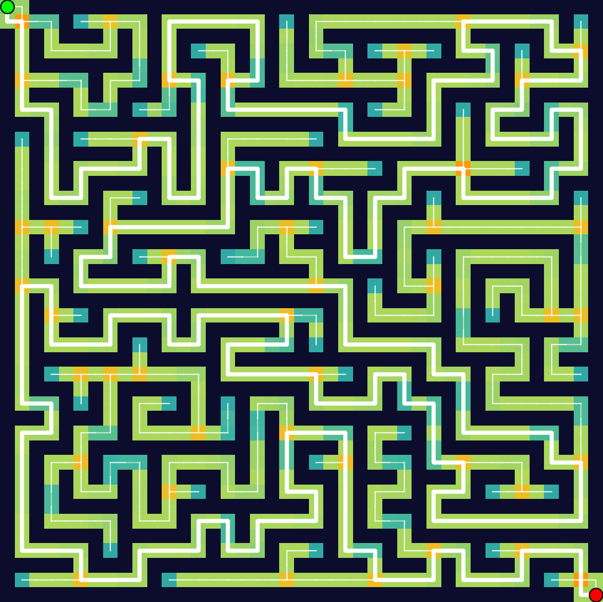
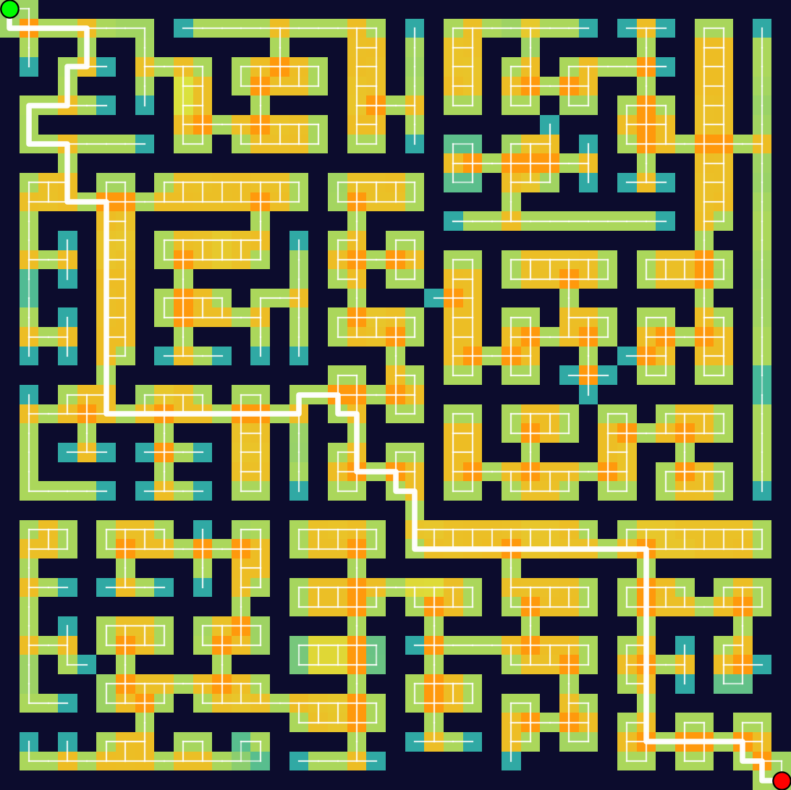
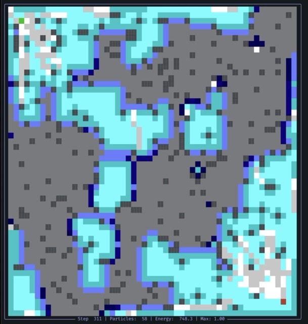
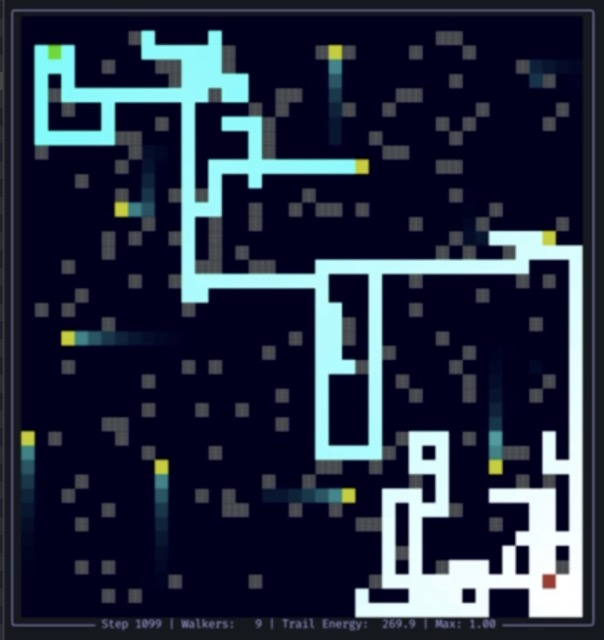
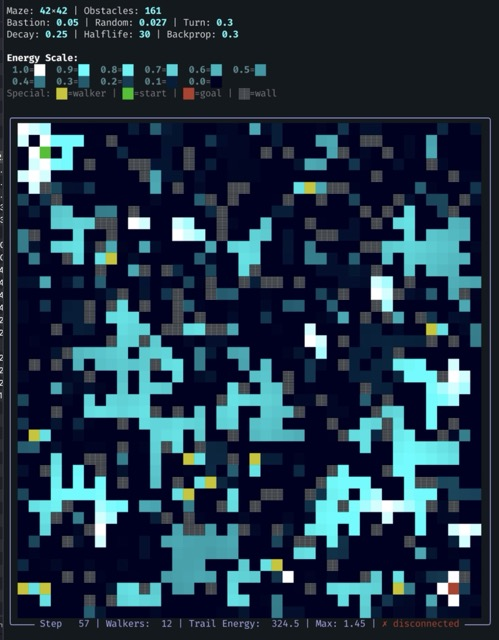

# THRML Flow Maze Solver

A THRML-based maze solver in `path_finding/thrml_flow_solver.py`. It frames the problem as a unit-flow energy model over directed edges, enforces flow conservation and anti-parallel constraints locally, and samples with THRML’s block Gibbs engine. The decoded flow yields a clean start-to-goal path, and the helper utilities render both ASCII and colorized PNG visualisations like the ones above.

## Example Mazes

### DFS Perfect



### Recursive Division



### Random Walls


## Quickstart

```bash
# create a virtualenv or use the provided venv/
./venv/bin/python -m path_finding.thrml_flow_solver
```

By default this generates a 42×42 maze (perfect DFS layout) and runs the flow sampler. The script prints an ASCII maze, saves a PNG, and returns the decoded path. Use the command-line arguments or tweak the `demo()` call at the bottom of `thrml_flow_solver.py` to switch maze types (`random_walls`, `dfs_perfect`, `recursive_division`), adjust sizes, or change sampling hyperparameters.

### Programmatic use

```python
from path_finding.thrml_flow_solver import generate_maze, solve_maze_flow, save_flow_path_png

maze = generate_maze(41, maze_type="recursive_division", seed=123)
path, meta = solve_maze_flow(maze, beta=8.0, rho_cons=12.0, rho_anti=12.0)

if path:
    save_flow_path_png(maze, path, start=meta["start"], goal=meta["goal"], outfile="flow.png")
```

## What's all this other stuff?

Everything outside of `path_finding/thrml_flow_solver.py` is older (and generally misguided) experiments. They explore tile-based encodings, spacetime graphs, wavefront IBMs, and other ideas that mostly failed to do anything useful but still produced some interesting visuals.







## Development

- Install dependencies with the `venv/` bootstrap or your own environment (`pip install -r requirements.txt`).
- Tests: `./venv/bin/pytest path_finding/tests/test_thrml_flow_solver.py`
- PNGs for the README were produced by running `demo()` with the three maze types and saving the outputs to `path_finding/thrml_flow_*.png`.

MIT License.
